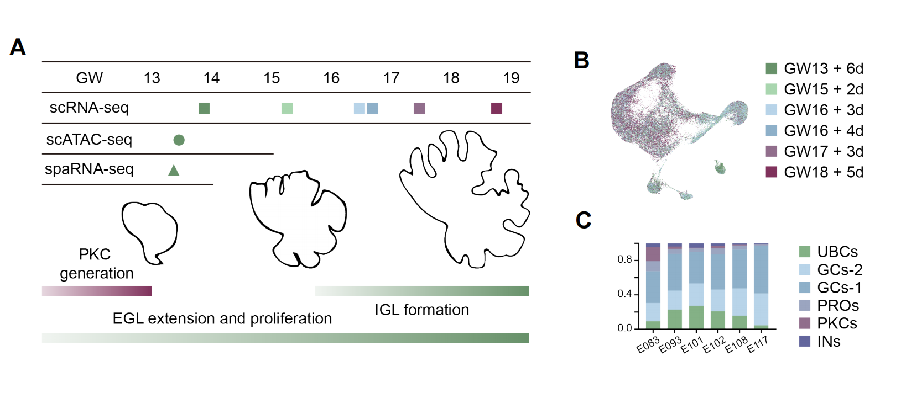

# The Developmental Progress of Human Cerebellum Investigated by Multi-omics High-resolution Sequencing Technologies

Here is the code of our papaer: **The Developmental Progress of Human Cerebellum Investigated by Multi-omics High-resolution Sequencing Technologies**

**If you have any questions, please contact us：**[**Our Lab**](http://english.genetics.cas.cn/people/faculty/index_20424.html?json=http://sourcedb.genetics.cas.cn/yw/people/peop/faculty/200907/t20090721_2130952.json)

## Table of Contents
- [Introduction](#introduction)
- [Dataset](#dataset)
- [Results](#results)
- [Acknowledgments](#acknowledgments)

## Introduction

The cerebellum is a crucial component of the central nervous system, housing over 80% of the brain's total neurons. Its integrated neural networks coordinate various functions such as motor control, cognition, emotion, and language. Different regions of the cerebellar cortex activate in response to specific functions, and impairments in cerebellar circuits can hinder motor system function and cause disorders such as autism spectrum symptoms and attention disorders. This repository contains code and instructions for analyzing multi-omics human cerebellum datasets. Multi-omics data provide a comprehensive view of the molecular landscape of the human cerebellum by integrating multiple levels of omics data, including the gene expression patterns, epigenetic modifications, and chromatin accessibility changes during cerebellar development, providing a comprehensive understanding of the molecular mechanisms underlying cerebellar development

## Dataset
Single cell transcriptome of 6 fetuses collected from GW13 to GW18 were sequenced by droplet-based pipeline. The emergence of the PKCs has already completed at this period, while EGL are undergoing fast proliferation to produce a huge number of GCs. From GW16, postmitotic GCs start to migrate inwards to form the IGL and become morphologically distinguishable at GW18. The scATAC-seq was applied to a sample at GW13, with the expectation of decoding the potential gene regulatory networks of the cerebellar development. Spatial transcriptomic data from GW13 was generated to facilitate the interpretation of the cellular distribution.

And we also provide a online platform for the visualization of the data. [**Our Platform**](http://sourcedb.genetics.cas.cn/yw/people/peop/faculty/200907/t20090721_2130952.json)

## Results
Similar to mouse, two kinds of granular progenitors with different stemness were identified. However, several granular progenitor marker genes are specifically expressed in human but not in mouse. In addition to the stemness, granular lineages can be distinguished in different spatial aspects, which was further confirmed by spatial RNA-seq data. Potential anterior and posterior enriched genes represented by BARHL1 and TLX3 were found in human, but not in mouse sequencing data. Plausible ventral and dorsal specific genes were also observed, namely PRR35, EBF2 and HEY1. Further analysis unveiled the marker genes of various granular sub-lineages. There might be a preference of proteins related to O-linked glycosylation pathway in different lineages. Furthermore, analysis of UBC suggested a potential stem cell cluster which may give rise to classic WLS+ RL progenitors. Different UBC subtypes were identified and the underneath gene regulatory networks were constructed. Apart from excitatory neuronal lineages, GABAergic neurons were characterized as well. The progenitors which generated interneurons may be separated into different stages. The classification of PKC indicated the existence of three subtypes with different gene expression patten. Through the combination of scRNA-seq and scATAC-seq, gene regulatory networks and potential specific upstream regulators were identified.

## Acknowledgments

